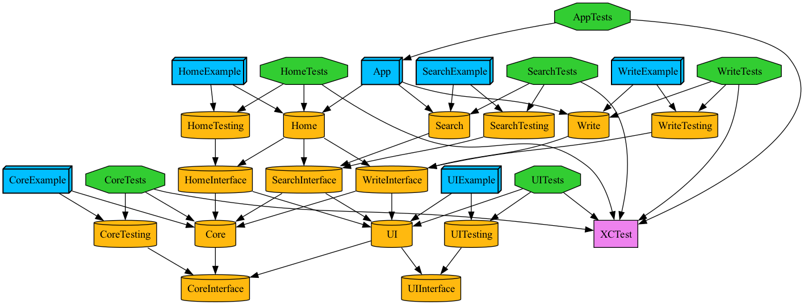

# TuistMemo
Simple Memo App with SwiftUI & µFeature Architecture

## Summary
- SwiftUI
- µFeature Architecture
- Tuist (modularization, scaffold) (version 3.17.0)
- Core Data
- Unit Test
- Injector - Coordinator

## Dependency Graph
  

## Getting Started
1. clone or download this repository
2. execute `tuist generate`

## More Information
### Feature Types
1. App : 앱의 처음 시작 Entry를 담당합니다.
  App은 모든 Product에 대해 의존성을 갖고 있습니다. 의존성 주입을 통해 의존성 역전을 구현합니다.
2. Product : 사용자가 직접 상호작용 하는 Feature를 의미합니다.
  각 Product의 Source 모듈은 다른 Product의 Interface 모듈에 의존 가능합니다.
  모든 Product는 병렬적으로 구성됩니다.
3. Foundation : Product에서 공통적으로 사용하는 Feature를 의미합니다.
  UI, Core Data 등이 Foundation에 속합니다.
  모든 Foundation은 병렬적으로 구성됩니다.

### Module(Target) Types
Feature를 생성하면 의존 관계가 미리 정의된 5가지 타겟이 자동으로 생성됩니다.
1. Example : Mock 데이터를 활용하여 예제 App을 구성합니다.
2. Tests : Unit Test를 담당합니다.
3. Testing : Mock 데이터를 구성합니다.
4. Source : 주요 기능 및 뷰를 담당합니다. Injector를 받는 Coordinator 뷰는 여기서 구현해야 합니다. (Coordinator는 화면의 시작점을 의미합니다)
5. Interface : 추상화를 담당합니다. 다른 Feature에서 사용할 수 있는 모델, 프로토콜, Injector 등이 위치합니다.

### How to add new module
1. 추가하고 싶은 Feature Type이 무엇인지 판단합니다. (Product or Foundation)
2. 추가하고 싶은 타입이 Product라면 다음과 같이 입력합니다 : `tuist scaffold product --name Home`
   추가하고 싶은 타입이 Foundation이라면 다음과 같이 입력합니다. : `tuist scaffold foundation --name Core`
3. `tuist edit` 명령어로 편집 화면에 진입합니다.
4. Workspace.swift와 Project/{새로 추가한 Feature 이름}/Project.swift 파일을 수정해야 합니다.
   Workspace.swift에는 새로 추가한 모듈 이름만 적어주면 됩니다.
   Project.swift 파일에는 dependency를 정의해주어야 합니다. 배열 안에 새로운 의존하고 싶은 모듈의 이름만 추가해주면 됩니다.
